<div style="page-break-after: always;"></div>

# 智能化软件开发实践

# 项目报告

## 第八组

| 姓名 | 学号 |
|------|------|
| 刘沛秋 | 23009200512 |
| 邱尹鸿 | 23009201337 |
| 冯逸凡 | 23009201054 |
| 王天睿 | 23009200966 |

---

<div style="page-break-after: always;"></div>

## 一、项目简介

### 1.1 项目背景

随着互联网行业竞争加剧，企业招聘面临三大痛点：**简历筛选效率低**（HR 日均处理上百份简历）、**候选人体验差**（投递后石沉大海、无进度反馈）、**管理决策缺乏数据支撑**（渠道 ROI 不可见、人才库沉睡）。传统 Excel + 邮件的招聘方式已无法满足快速扩张的互联网团队需求。

本项目基于课程《智能化软件开发实践》第二次作业要求，在「招聘岗位管理系统」基础上，演进为面向互联网行业的 **TalentFlow ATS（Applicant Tracking System）智能招聘平台**。系统定位为「人才生态与组织发展引擎」，通过 C/B/M 三端架构，分别服务求职者、HR/面试官与管理层。

### 1.2 项目目标

| 目标维度 | 具体目标 |
|----------|----------|
| 业务目标 | 实现岗位全生命周期管理、多角色协同审批、智能投递与漏斗管理 |
| 技术目标 | 前后端分离、RESTful API、Token 鉴权、可一键启动演示 |
| 体验目标 | C 端「外卖式」进度追踪；B 端 AI 匹配辅助筛选；M 端数据驾驶舱 |
| 创新目标 | 简历解析免填、AI 匹配评分、智能答疑、淘汰反馈与人才库激活 |

### 1.3 系统核心能力

- **岗位全生命周期管理**：草稿（DRAFT）→ 待审批（PENDING）→ 已发布（PUBLISHED）→ 已关闭（CLOSED）
- **多角色协同**：部门账号提交岗位、招聘 HR 审批发布、求职者投递追踪、面试官协同、管理层数据决策
- **AI 智能辅助**：简历解析免填、人岗匹配评分、智能答疑、AI 初试题库、淘汰反馈与岗位推荐
- **招聘漏斗与 ROI 分析**：多渠道投递统计、阶段流转可视化、人才库 Top 10 展示

### 1.4 技术选型概述

系统采用前后端分离架构：后端以 **Spring Boot 3.2 + JPA + H2/MySQL** 构建 RESTful API；前端以 **Vue 3 + Element Plus + ECharts** 实现三端差异化界面；通过 Token 鉴权与 Vue Router 路由守卫实现角色权限隔离。开发过程全程使用 **Cursor AI 编码助手** 辅助，实现需求分析、架构设计、代码生成与 Bug 修复的智能化协作。

---

<div style="page-break-after: always;"></div>

## 二、需求分析

### 2.1 用户角色

本系统涉及五类注册用户角色及一类游客角色，各角色权限与使用场景如下。

**表 2-1 用户角色特征**

| 用户 | 特征 |
|------|------|
| **求职者（CANDIDATE）** | 浏览已发布岗位、上传/粘贴简历一键投递、查看投递进度（外卖式追踪）、AI 初试、24h 智能答疑 |
| **部门账号（DEPARTMENT）** | 人事部/技术部等业务部门。创建岗位草稿、编辑/删除、Excel 批量导入、提交审批 |
| **招聘 HR（ADMIN）** | 审批岗位（通过/驳回）、管理招聘漏斗、AI 匹配评分筛选、安排面试、关闭已发布岗位、查看统计 |
| **面试官（INTERVIEWER）** | 查看招聘漏斗、提交结构化面评、参与业务/HR 面试环节 |
| **管理层（EXECUTIVE）** | 管理驾驶舱：招聘漏斗、渠道 ROI、人才库 Top、Offer 接受率等决策指标 |
| **游客** | 无需登录，浏览已发布岗位列表与详情 |

**表 2-2 用户主要用例**

| 用户 | 主要用例 |
|------|----------|
| 求职者 | 1. 登录 2. 浏览公开岗位 3. 上传简历智能投递 4. 查看投递进度 5. AI 初试 6. 智能答疑 |
| 部门账号 | 1. 登录 2. 新增/编辑岗位 3. Excel 批量导入 4. 提交审批 5. 查看本部门岗位 |
| 招聘 HR | 1. 登录 2. 审批岗位 3. 招聘漏斗管理 4. 推进候选人阶段 5. 安排面试 6. 淘汰并生成反馈 |
| 面试官 | 1. 登录 2. 查看漏斗 3. 提交面评 |
| 管理层 | 1. 登录 2. 查看管理驾驶舱 3. 分析渠道 ROI 与人才库 |
| 游客 | 1. 浏览公开岗位 2. 查看岗位详情 |

### 2.2 用户故事

**C 端 · 求职者故事：**

1. 作为一名求职者，我希望无需复杂填表，上传简历后系统自动解析姓名/邮箱/技能，实现「免填投递」。
2. 作为一名求职者，我希望像追踪外卖一样看到简历处于「初筛、AI 面、业务面、HR 面、Offer」哪个阶段。
3. 作为一名求职者，我希望 24 小时可向 AI 咨询薪酬、地点、福利等问题，获得即时回复。
4. 作为一名求职者，即便被淘汰，我也希望收到有温度的反馈和更匹配的岗位推荐。

**B 端 · HR/面试官故事：**

1. 作为 HR，我希望系统自动给简历打匹配分并标出亮点与风险（如跳槽频繁），将筛选时间从 30 分钟/份缩短至 5 分钟/份。
2. 作为 HR，我希望在一个漏斗页面完成阶段推进、安排面试、淘汰入人才库，避免多系统切换。
3. 作为面试官，我希望使用结构化面评模板（技术/沟通/文化维度），减少主观偏见。

**M 端 · 管理层故事：**

1. 作为 CHO/总监，我希望看到按渠道、按阶段的招聘 ROI，优化预算分配（如 Boss 直聘 vs 内推）。
2. 作为管理层，我希望动态管理私域人才库，激活 silver medal 候选人，降低重复招聘成本。

### 2.3 用例描述

#### (1) 用户登录认证（UC-01）

| 项目 | 内容 |
|------|------|
| ID | UC-01 |
| 名称 | 用户登录认证 |
| 参与者 | 求职者、部门账号、HR、面试官、管理层 |
| 触发条件 | 用户在登录页输入用户名密码点击「登录」 |
| 前置条件 | 账号已初始化；密码正确 |
| 后置条件 | 返回 Token；前端存入 localStorage；按角色跳转首页 |
| 主流程 | 1. 访问登录页 2. 输入账号密码 3. 后端 BCrypt 校验 4. 生成 UUID Token 5. 返回用户信息 6. 前端响应式更新导航栏 |
| 扩展流程 | 游客可直接访问公开岗位；Token 过期返回 401 并跳转登录 |

#### (2) 一键智能投递（UC-02）

| 项目 | 内容 |
|------|------|
| ID | UC-02 |
| 名称 | 一键智能投递 |
| 参与者 | 求职者 |
| 触发条件 | 求职者在岗位详情页点击「一键投递」 |
| 前置条件 | 已登录为 CANDIDATE；岗位状态为 PUBLISHED |
| 后置条件 | 创建 Application 记录；计算 AI 匹配分；进入 APPLIED/SCREENING 阶段 |
| 主流程 | 1. 上传 TXT/Excel 简历或粘贴文本 2. ResumeParseService 解析字段 3. AiMatchingService 计算匹配度 4. 写入 application 表 5. 跳转「我的投递」 |
| 扩展流程 | 重复投递同一岗位提示错误；匹配分≥75 自动进入 SCREENING |

#### (3) 招聘漏斗阶段推进（UC-03）

| 项目 | 内容 |
|------|------|
| ID | UC-03 |
| 名称 | 招聘漏斗阶段推进 |
| 参与者 | 招聘 HR |
| 触发条件 | HR 在漏斗页点击「进 AI 面/进业务面/发 Offer/淘汰」 |
| 前置条件 | 已登录为 ADMIN；存在待处理申请 |
| 后置条件 | Application.stage 更新；淘汰时写入 aiFeedback 并加入人才库 |
| 主流程 | 1. HR 进入招聘漏斗 2. 查看 AI 匹配分与风险 3. 选择阶段操作 4. 系统更新 stage 5. 刷新漏斗统计 |
| 扩展流程 | 淘汰时 AI 生成感谢信 + 推荐岗位；inTalentPool=true |

#### (4) 岗位审批与发布（UC-04）

| 项目 | 内容 |
|------|------|
| ID | UC-04 |
| 名称 | 岗位审批与发布 |
| 参与者 | 部门账号、招聘 HR |
| 触发条件 | 部门提交审批；HR 点击通过/驳回 |
| 前置条件 | 岗位处于 DRAFT/PENDING 状态 |
| 后置条件 | 通过后 status=PUBLISHED；驳回后退回 DRAFT |
| 主流程 | 1. 部门创建草稿 2. 提交审批 3. HR 审批 4. 岗位公开发布 5. 游客/求职者可浏览 |

#### (5) Excel 批量导入岗位（UC-05）

| 项目 | 内容 |
|------|------|
| ID | UC-05 |
| 名称 | Excel 批量导入岗位 |
| 参与者 | 部门账号 |
| 触发条件 | 部门用户在导入页上传 Excel 文件 |
| 前置条件 | 文件格式符合模板（岗位名称、岗位描述两列） |
| 后置条件 | 批量创建 DRAFT 状态岗位 |
| 主流程 | 1. 下载模板 2. 填写岗位数据 3. 上传文件 4. POI 解析 5. 返回导入结果 |

#### (6) 管理驾驶舱数据查看（UC-06）

| 项目 | 内容 |
|------|------|
| ID | UC-06 |
| 名称 | 管理驾驶舱数据查看 |
| 参与者 | 管理层、HR |
| 触发条件 | 用户访问 /management/dashboard |
| 前置条件 | 角色为 EXECUTIVE 或 ADMIN |
| 后置条件 | 展示 KPI、漏斗图、渠道 ROI、人才库 Top |
| 主流程 | 1. 请求 dashboard API 2. AtsAnalyticsService 聚合数据 3. ECharts 渲染图表 |

### 2.4 测试用例

**表 2-3 系统测试用例**

| 编号 | 名称 | 测试步骤 | 预期结果 | 优先级 |
|------|------|----------|----------|--------|
| TC-001 | 用户登录 | candidate/candidate123 登录 | 跳转「我的投递」，导航显示用户名 | 高 |
| TC-002 | 游客浏览 | 未登录访问 /public | 展示已发布岗位列表 | 高 |
| TC-003 | 智能投递 | 求职者上传简历投递 | 解析成功，显示匹配分 | 高 |
| TC-004 | 进度追踪 | 查看我的投递 | Steps 组件展示当前阶段 | 高 |
| TC-005 | 漏斗推进 | HR 将候选人推进至业务面 | stage 更新为 BUSINESS_INTERVIEW | 高 |
| TC-006 | 岗位审批 | admin 审批通过待审批岗位 | status 变为 PUBLISHED | 高 |
| TC-007 | Excel 导入 | dept_hr 上传模板 | 批量创建草稿岗位 | 中 |
| TC-008 | 管理驾驶舱 | executive 查看 dashboard | 漏斗图、渠道 ROI 正常渲染 | 中 |
| TC-009 | 权限隔离 | 部门账号访问 /recruiter/pipeline | 403 或重定向 | 高 |
| TC-010 | AI 答疑 | 求职者提问「薪资范围」 | 返回薪酬相关回答 | 中 |
| TC-011 | 岗位关闭 | HR 关闭已发布岗位 | status 变为 CLOSED，公开列表不可见 | 中 |
| TC-012 | 面试安排 | HR 为候选人安排业务面 | interview 记录创建 | 中 |
| TC-013 | 面评提交 | 面试官提交结构化面评 | evaluation 记录写入 | 中 |
| TC-014 | 人才库 | 淘汰候选人后查看人才库 | inTalentPool=true 且可检索 | 中 |
| TC-015 | 搜索过滤 | 岗位列表按名称搜索 | 返回匹配结果 | 低 |

---

<div style="page-break-after: always;"></div>

## 三、系统概要设计

### 3.1 开发环境与技术

**硬件环境：**

- 开发设备：Windows 11 笔记本电脑
- 运行内存：16GB 及以上
- 处理器：Intel/AMD 64 位处理器

**软件环境：**

- 操作系统：Windows 11
- JDK 版本：JDK 17
- 构建工具：Maven 3.9+
- Node.js：18+
- 数据库：H2 内存数据库（默认，零配置）；可切换 MySQL 8
- 浏览器：Chrome / Edge

**表 3-1 技术栈明细**

| 层级 | 技术 | 版本 | 用途 |
|------|------|------|------|
| 后端框架 | Spring Boot | 3.2.5 | Web 容器、依赖注入 |
| ORM | Spring Data JPA | 3.2.x | 数据持久化 |
| 前端框架 | Vue | 3.x | SPA 单页应用 |
| 构建工具 | Vite | 5.x | 前端开发与打包 |
| UI 组件库 | Element Plus | 2.x | 表单、表格、步骤条 |
| 数据可视化 | ECharts | 5.x | 漏斗图、饼图、柱状图 |
| 认证方案 | UUID Token | — | 无状态会话 |
| 密码加密 | BCrypt | — | 密码哈希存储 |
| Excel 解析 | Apache POI | 5.2 | 批量导入 |
| HTTP 客户端 | Axios | 1.x | API 请求封装 |

**AI 辅助编程工具：**

- **Cursor AI 编码助手**：需求分析、架构设计、前后端代码生成、Bug 修复
- 开发方式：通过多轮对话完成 90% 以上代码生成，人工调整路由、权限、启动脚本等

### 3.2 系统架构

本系统采用经典的前后端分离 B/S 架构，按 C/B/M 三端划分：

```
┌─────────────────────────────────────────────────────────┐
│                    前端 Vue 3 SPA (:5180)                │
│  ┌──────────┐  ┌──────────┐  ┌──────────┐              │
│  │ C端页面   │  │ B端页面   │  │ M端页面   │              │
│  │公开岗位   │  │招聘漏斗   │  │管理驾驶舱 │              │
│  │我的投递   │  │岗位管理   │  │统计图表   │              │
│  │智能投递   │  │Excel导入  │  │人才库     │              │
│  └────┬─────┘  └────┬─────┘  └────┬─────┘              │
│       └─────────────┼─────────────┘                     │
│                     │ Axios /webapi                     │
└─────────────────────┼───────────────────────────────────┘
                      ▼
┌─────────────────────────────────────────────────────────┐
│              Spring Boot REST API (:8080)                │
│  AuthInterceptor → Controller → Service → Repository     │
│  ┌────────────┐ ┌────────────┐ ┌────────────┐         │
│  │/candidate/*│ │/recruiter/*│ │/management/*│         │
│  │/positions/*│ │/auth/*     │ │            │         │
│  └────────────┘ └────────────┘ └────────────┘         │
└─────────────────────┼───────────────────────────────────┘
                      ▼
              ┌───────────────┐
              │ H2 / MySQL    │
              │ position      │
              │ application   │
              │ sys_user      │
              │ interview     │
              └───────────────┘
```

**认证鉴权链：**

请求到达 → AuthInterceptor（解析 Bearer Token → 注入 UserContext）→ 角色权限校验（CANDIDATE/ADMIN/DEPARTMENT 等）→ Controller 执行业务逻辑 → 统一 ApiResponse 包装返回

**前端路由守卫：**

用户访问页面 → Vue Router beforeEach → 检查 meta.public/guest → 检查 Token 存在性 → 检查 meta.role 权限 → 通过或重定向至 getHomeRoute(role)

### 3.3 数据设计

**数据库 ER 关系：**

```
sys_user ──1:N──→ application ←──N:1── position
                      │
                      ├── 1:N ──→ interview
                      └── 1:N ──→ interview_evaluation
```

**表 3-2 sys_user（用户表）**

| 字段名 | 类型 | 说明 |
|--------|------|------|
| id | BIGINT | 主键，自增 |
| username | VARCHAR(50) | 用户名，唯一 |
| password | VARCHAR(100) | BCrypt 加密密码 |
| display_name | VARCHAR(50) | 显示名称 |
| department | VARCHAR(100) | 部门 |
| role | VARCHAR(20) | ADMIN/DEPARTMENT/CANDIDATE/INTERVIEWER/EXECUTIVE |
| created_at | DATETIME | 创建时间 |

**表 3-3 position（岗位表）**

| 字段名 | 类型 | 说明 |
|--------|------|------|
| id | BIGINT | 主键 |
| title | VARCHAR(200) | 岗位名称 |
| description | TEXT | 岗位描述 |
| status | VARCHAR(20) | DRAFT/PENDING/PUBLISHED/CLOSED |
| created_by_id | BIGINT | 提交人 ID |
| created_by_name | VARCHAR(50) | 提交人姓名 |
| department | VARCHAR(100) | 提交部门 |
| approver | VARCHAR(100) | 审批人 |
| approval_comment | TEXT | 审批意见 |
| published_at | DATETIME | 发布时间 |
| created_at / updated_at | DATETIME | 时间戳 |

**表 3-4 application（投递/申请表）**

| 字段名 | 类型 | 说明 |
|--------|------|------|
| id | BIGINT | 主键 |
| position_id | BIGINT | 岗位 ID |
| candidate_id | BIGINT | 求职者 ID |
| candidate_name | VARCHAR(50) | 候选人姓名 |
| candidate_email | VARCHAR(100) | 邮箱 |
| candidate_phone | VARCHAR(20) | 手机 |
| stage | VARCHAR(30) | 招聘阶段枚举 |
| channel | VARCHAR(20) | 投递渠道 |
| resume_text | TEXT | 简历原文 |
| parsed_skills | TEXT | 解析技能 |
| match_score | INT | AI 匹配分（0-99） |
| match_highlights | TEXT | 匹配亮点 |
| match_risks | TEXT | 潜在风险 |
| ai_feedback | TEXT | 淘汰反馈 |
| recommended_positions | TEXT | 推荐岗位 |
| in_talent_pool | BOOLEAN | 是否在人才库 |
| applied_at / updated_at | DATETIME | 时间戳 |

**表 3-5 interview / interview_evaluation**

| 表 | 核心字段 | 说明 |
|----|----------|------|
| interview | application_id, interviewer_id, type, scheduled_at | 面试安排（AI/BUSINESS/HR） |
| interview_evaluation | technical_score, communication_score, culture_score | 结构化面评 |

### 3.4 功能模块说明

**C 端 · 求职者模块：**

- 公开岗位浏览：无需登录浏览 PUBLISHED 岗位
- 一键智能投递：ResumeParseService 解析 + 自动填表
- 进度追踪：Steps 组件展示 APPLIED→SCREENING→AI_INTERVIEW→BUSINESS_INTERVIEW→HR_INTERVIEW→OFFER→HIRED
- AI 初试：返回结构化面试题库
- 智能答疑：基于规则引擎回答薪酬/地点/福利问题

**B 端 · HR/面试官模块：**

- 岗位管理：部门 CRUD + HR 审批 + 生命周期
- 招聘漏斗：按 stage 筛选、AI 匹配分排序、阶段推进
- 面试安排：ScheduleInterview + 结构化面评
- Excel 批量导入：POI 解析「岗位名称」「岗位描述」

**M 端 · 管理层模块：**

- 管理驾驶舱：KPI 卡片 + 漏斗柱状图 + 渠道饼图
- 渠道 ROI：各渠道投递量/录用量/转化率
- 人才库 Top 10：inTalentPool=true 的候选人

### 3.5 项目目录结构

```
第二次/
├── backend/                    # Spring Boot 后端
│   └── src/main/java/com/recruitment/
│       ├── controller/         # REST 控制器
│       ├── service/            # 业务逻辑
│       ├── entity/             # JPA 实体
│       ├── repository/         # 数据访问
│       ├── config/             # 拦截器、初始化
│       └── dto/                # 请求/响应对象
├── frontend/                   # Vue 3 前端
│   └── src/
│       ├── views/              # 页面组件
│       ├── api/                # Axios 封装
│       ├── router/             # 路由与守卫
│       └── utils/              # auth 状态管理
├── docs/                       # 文档与截图
├── start-all.bat               # 一键启动
├── start-backend.bat
└── start-frontend.bat
```

---

<div style="page-break-after: always;"></div>

## 四、详细设计及实现

### 4.1 后端接口规范

统一响应格式：

```json
{
  "code": 200,
  "message": "success",
  "data": {}
}
```

**表 4-1 认证接口**

| 方法 | URL | 说明 | 认证 |
|------|-----|------|------|
| POST | /webapi/auth/login | 用户登录 | 无 |
| POST | /webapi/auth/logout | 退出登录 | Token |
| GET | /webapi/auth/me | 当前用户信息 | Token |

**表 4-2 岗位管理接口**

| 方法 | URL | 说明 | 角色 |
|------|-----|------|------|
| GET | /webapi/positions | 岗位列表（含筛选） | ADMIN/DEPARTMENT |
| GET | /webapi/positions/published | 公开岗位列表 | 无 |
| GET | /webapi/public/positions/{id} | 公开岗位详情 | 无 |
| POST | /webapi/positions | 创建岗位 | DEPARTMENT |
| PUT | /webapi/positions/{id} | 更新岗位 | DEPARTMENT |
| DELETE | /webapi/positions/{id} | 删除岗位 | DEPARTMENT |
| POST | /webapi/positions/{id}/submit | 提交审批 | DEPARTMENT |
| POST | /webapi/positions/{id}/approve | 审批通过 | ADMIN |
| POST | /webapi/positions/{id}/reject | 审批驳回 | ADMIN |
| POST | /webapi/positions/{id}/close | 关闭岗位 | ADMIN |
| GET | /webapi/positions/template | 下载导入模板 | DEPARTMENT |
| POST | /webapi/positions/import | Excel 批量导入 | DEPARTMENT |
| GET | /webapi/positions/statistics | 岗位统计 | ADMIN/EXECUTIVE |

**表 4-3 求职者（C 端）接口**

| 方法 | URL | 说明 |
|------|-----|------|
| POST | /webapi/candidate/apply | 文本投递 |
| POST | /webapi/candidate/apply/upload | 文件上传投递 |
| POST | /webapi/candidate/resume/parse | 简历解析预览 |
| GET | /webapi/candidate/applications | 我的投递列表 |
| GET | /webapi/candidate/applications/{id}/ai-interview | AI 初试题库 |
| POST | /webapi/candidate/positions/{id}/ask | 智能答疑 |

**表 4-4 招聘方（B 端）接口**

| 方法 | URL | 说明 |
|------|-----|------|
| GET | /webapi/recruiter/applications | 漏斗列表 |
| PUT | /webapi/recruiter/applications/{id}/stage | 阶段推进 |
| POST | /webapi/recruiter/interviews | 安排面试 |
| POST | /webapi/recruiter/evaluations | 提交面评 |
| GET | /webapi/recruiter/talent-pool | 人才库列表 |

**表 4-5 管理层（M 端）接口**

| 方法 | URL | 说明 |
|------|-----|------|
| GET | /webapi/management/dashboard | 管理驾驶舱数据 |

**主要错误码：**

| code | HTTP | 含义 |
|------|------|------|
| 200 | 200 | 成功 |
| 400 | 400 | 参数/业务校验失败 |
| 401 | 401 | 未登录 |
| 403 | 403 | 权限不足 |
| 404 | 404 | 资源不存在 |
| 500 | 500 | 服务器错误 |

#### 接口示例：用户登录

**请求：**

```http
POST /webapi/auth/login
Content-Type: application/json

{"username": "admin", "password": "admin123"}
```

**响应：**

```json
{
  "code": 200,
  "message": "success",
  "data": {
    "token": "a1b2c3d4-...",
    "userId": 2,
    "username": "admin",
    "displayName": "招聘HR",
    "role": "ADMIN",
    "department": "人力资源部"
  }
}
```

### 4.2 系统界面截图与说明

以下截图为系统实际运行界面（访问地址 http://localhost:5180，由 Playwright 自动化截取）。

#### 图 4-1 用户登录页

登录页展示 TalentFlow ATS 品牌、用户名/密码表单及测试账号提示，支持游客直接进入公开岗位浏览。

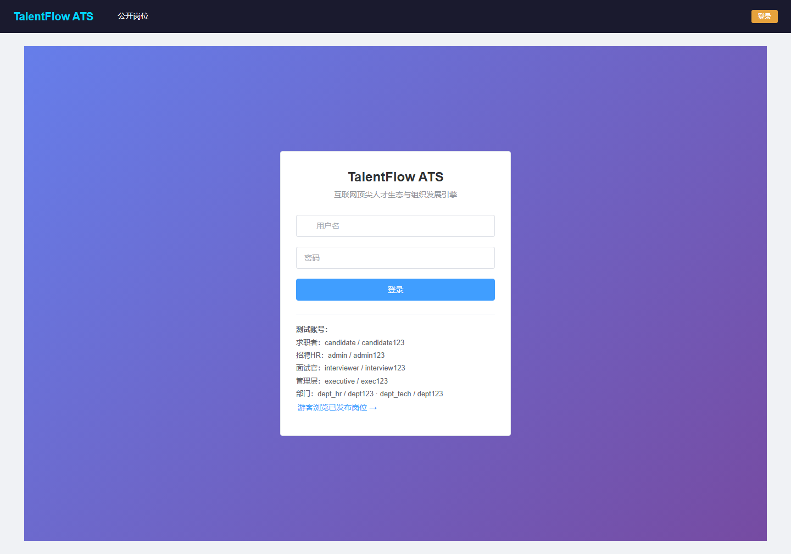

#### 图 4-2 公开岗位列表（游客/C 端）

无需登录即可浏览所有已发布（PUBLISHED）岗位，卡片式布局展示岗位名称、部门与描述摘要。

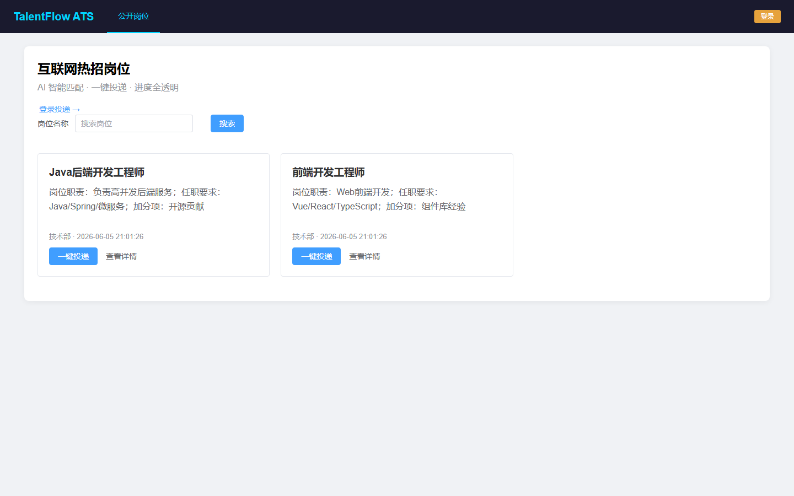

#### 图 4-3 公开岗位详情

展示岗位完整描述，求职者登录后可点击「一键投递」进入智能投递流程。

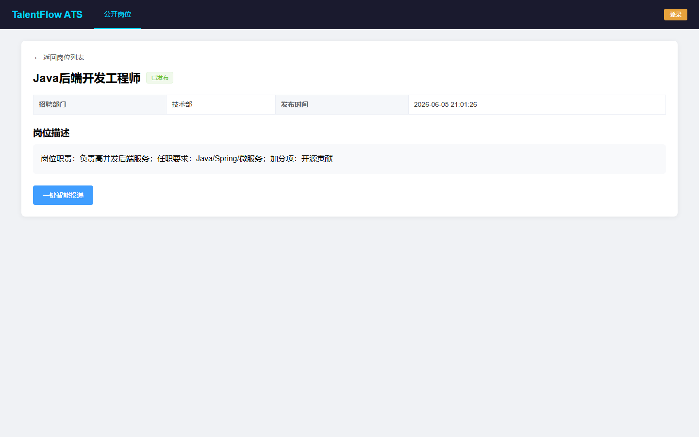

---

<div style="page-break-after: always;"></div>

#### 图 4-4 我的投递（C 端进度追踪）

求职者登录后可在「我的投递」页面查看所有申请记录，Element Plus Steps 组件以「外卖追踪」方式展示当前所处招聘阶段，并显示 AI 匹配分、亮点与风险提示。

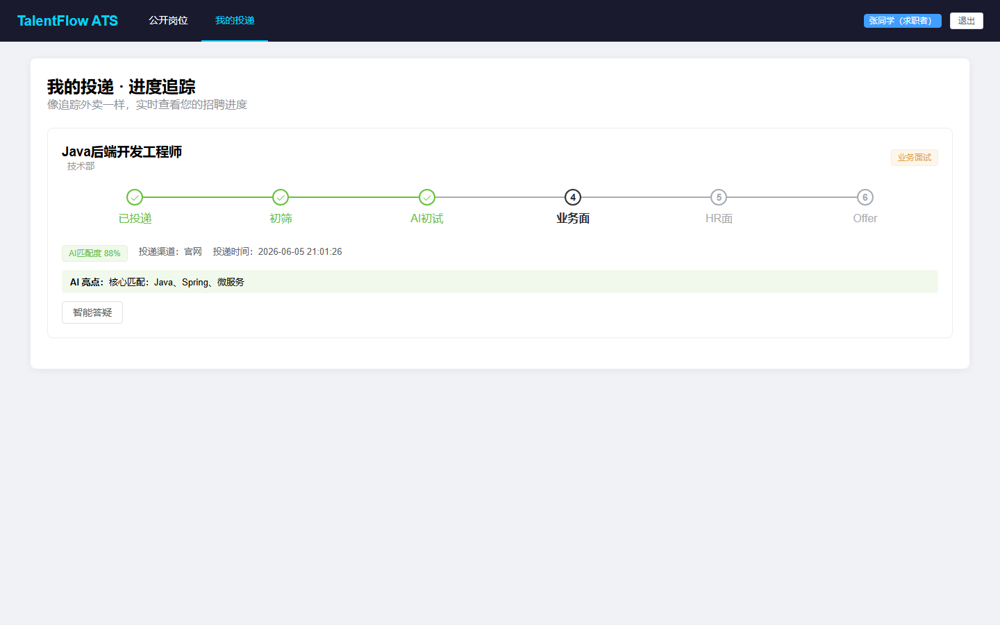

#### 图 4-5 智能投递页（C 端）

支持上传 TXT/Excel 简历或粘贴文本，系统自动解析姓名、邮箱、手机与技能标签，实现免填投递。

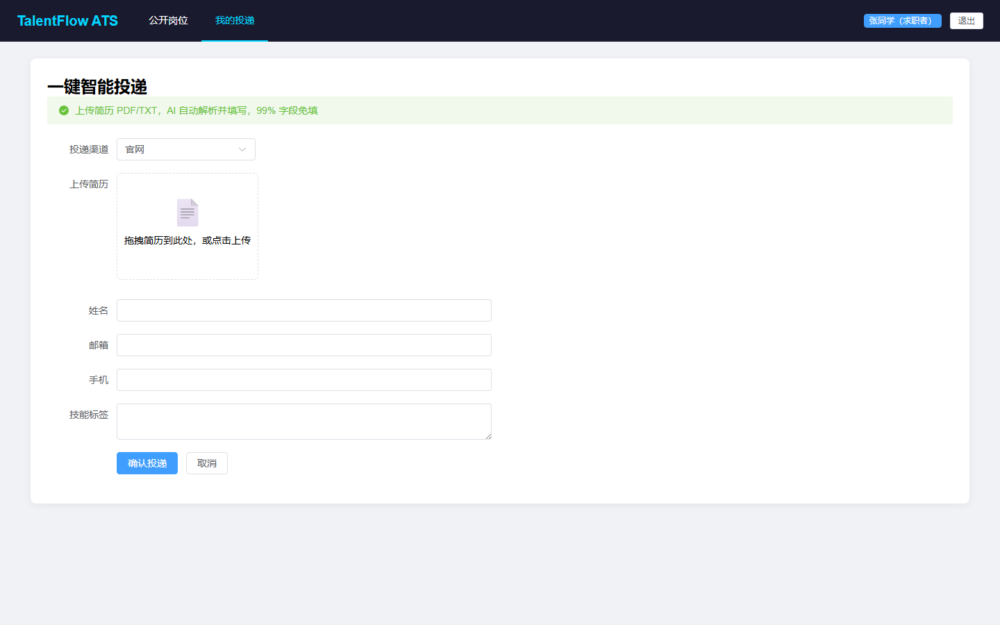

#### 图 4-6 招聘漏斗（B 端 · HR）

HR 登录后可查看按阶段分组的候选人列表，顶部展示各阶段人数统计，表格中 matchScore 以进度条可视化，支持一键推进阶段或淘汰。

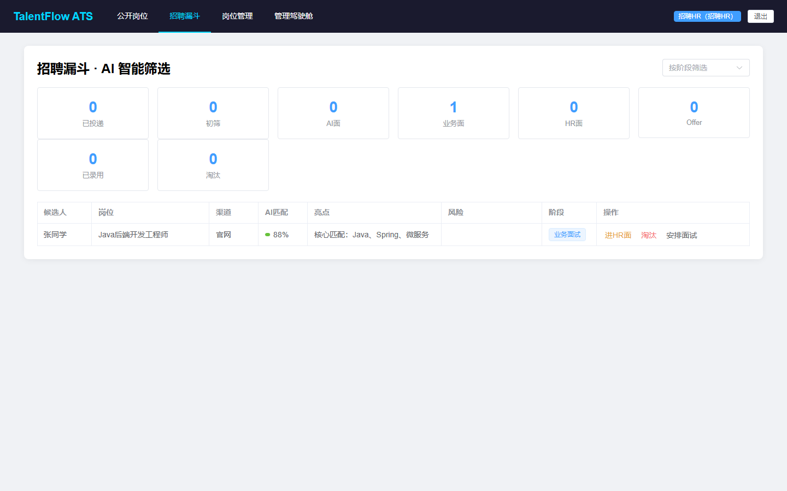

#### 图 4-7 岗位管理（B 端 · HR）

HR 可查看全部岗位、审批待审批岗位、关闭已发布岗位；表格支持按状态筛选与搜索。

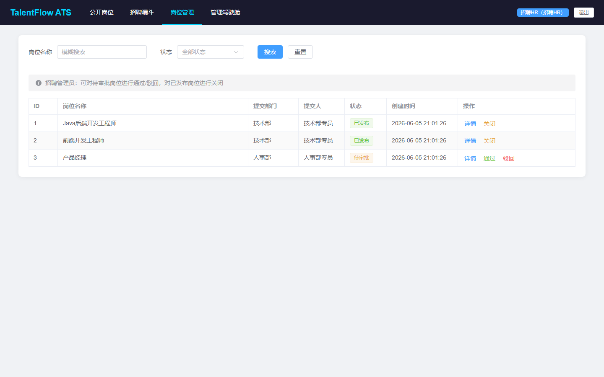

---

<div style="page-break-after: always;"></div>

#### 图 4-8 数据统计页

展示各状态岗位数量柱状图及汇总数据，供 HR 与管理层了解招聘需求发布情况。

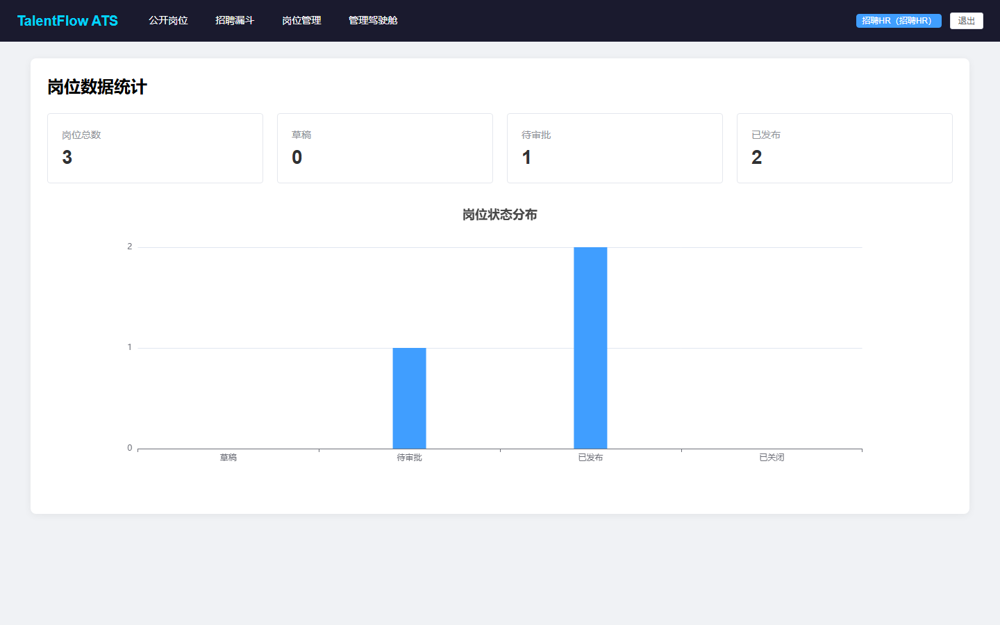

#### 图 4-9 部门岗位管理（B 端 · 部门）

部门账号（dept_hr）仅可管理本部门提交的岗位，支持新建、编辑、删除与提交审批。

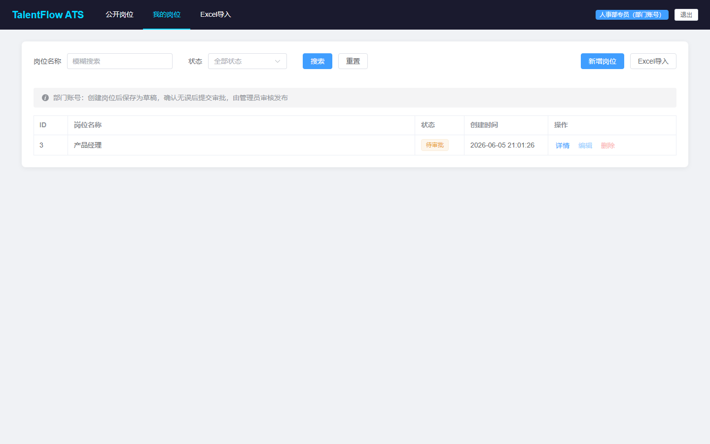

#### 图 4-10 Excel 批量导入

部门用户可下载标准模板，填写「岗位名称」「岗位描述」后上传，系统通过 Apache POI 批量创建草稿岗位。

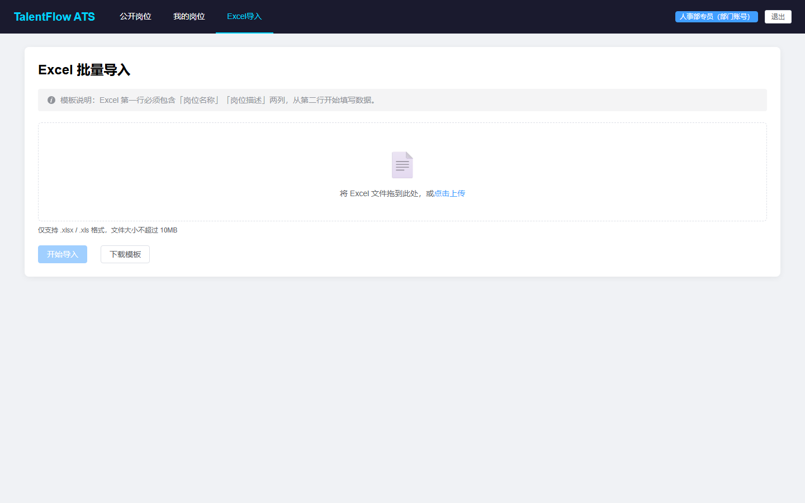

#### 图 4-11 新建岗位表单

部门用户填写岗位名称与描述后保存为草稿（DRAFT），随后可提交审批。

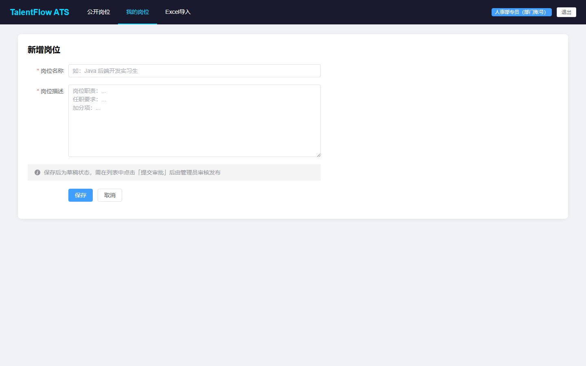

---

<div style="page-break-after: always;"></div>

#### 图 4-12 管理驾驶舱（M 端）

管理层登录后可查看 KPI 卡片（总投递、在流程中、已录用、人才库规模）、招聘漏斗柱状图、渠道 ROI 饼图及人才库 Top 10 列表。

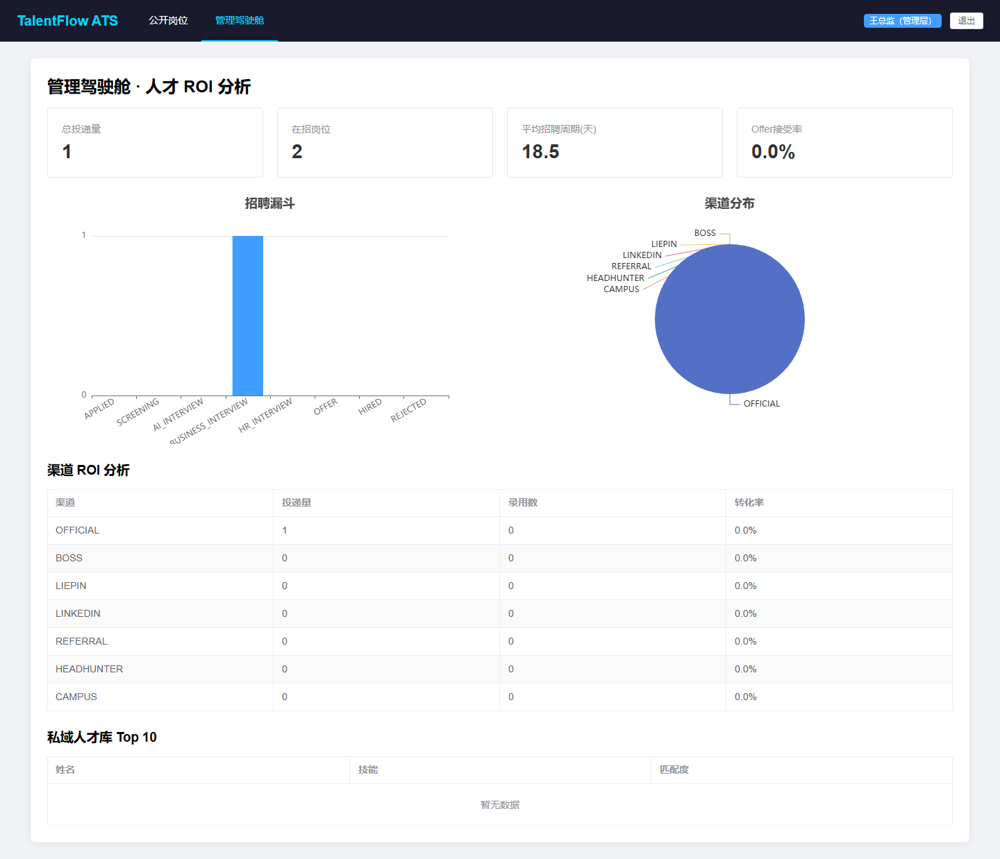

#### 图 4-13 面试官视图（B 端）

面试官账号可查看招聘漏斗中的候选人，参与业务面/HR 面环节并提交结构化面评。

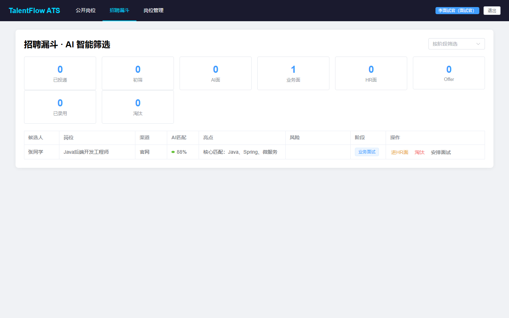

### 4.3 AI 智能体辅助开发说明

本系统大量使用 **Cursor AI 编码助手** 辅助前后端开发，典型提示词策略如下：

| 序号 | 提示词目标 | 生成结果 |
|------|------------|----------|
| 1 | 创建 Vue 3 App.vue，深色顶栏 TalentFlow ATS，按角色显示不同菜单 | 三端差异化导航栏 |
| 2 | CandidateApplications.vue，外卖式 Steps 进度条 | C 端进度追踪页 |
| 3 | RecruiterPipeline.vue，漏斗统计 + matchScore 进度条 | B 端招聘漏斗 |
| 4 | ManagementDashboard.vue，KPI + ECharts | M 端管理驾驶舱 |
| 5 | Spring Boot AuthInterceptor + TokenStore | 后端鉴权链 |
| 6 | AiMatchingService 规则引擎匹配分 | AI 匹配模块 |

### 4.4 核心模块实现说明

#### 4.4.1 Token 认证鉴权模块

- **TokenStore**：ConcurrentHashMap 存储 UUID Token → UserContext
- **AuthService**：BCrypt 密码校验 + Token 创建/销毁
- **AuthInterceptor**：拦截 /webapi/**，公开路径（login、published）放行，按路径前缀校验角色
- **UserContextHolder**：ThreadLocal 传递当前用户，请求结束 clear

#### 4.4.2 简历解析与 AI 匹配模块

**ResumeParseService** 通过正则提取邮箱（`[\w.-]+@[\w.-]+\.\w+`）、手机号（11 位），并基于关键词库识别 Java/Vue/Spring/Python 等技能。

**AiMatchingService** 核心算法：

1. 从 JD（岗位标题+描述）检测关键词集合
2. 与简历文本做包含匹配，计算 baseScore = matched/total × 100
3. 加分项：「项目」「实习」出现次数
4. 减分项：跳槽次数 × 5（识别「20xx-20xx」模式）
5. 最终 score 限制在 30-99 区间

#### 4.4.3 招聘漏斗模块

阶段枚举流转：

```
APPLIED → SCREENING → AI_INTERVIEW → BUSINESS_INTERVIEW → HR_INTERVIEW → OFFER → HIRED
                                                                              ↘ REJECTED（入人才库）
```

淘汰时自动调用 `generateRejectionFeedback` 生成感谢信，写入 `aiFeedback`，设置 `inTalentPool=true`。

#### 4.4.4 前端响应式登录状态

原问题：`computed(() => getUser())` 读取 localStorage 不触发重渲染。

解决方案：使用 Vue `reactive authState` 包装 token/user，`setAuth`/`clearAuth` 同步更新 state 与 localStorage，Header 组件直接绑定 `authState.user`。

### 4.5 部署与启动

**表 4-6 启动脚本说明**

| 脚本 | 功能 |
|------|------|
| start-all.bat | 清理 8080 端口 → 启动后端 → 等待 25s → 启动前端 → 打开浏览器 |
| start-backend.bat | mvn package → java -jar target/position-management-1.0.0.jar |
| start-frontend.bat | npm install → npm run dev（端口 5180） |

**访问地址：**

- 前端：http://localhost:5180
- 后端 API：http://localhost:8080/webapi
- H2 控制台：http://localhost:8080/h2-console（如启用）

---

<div style="page-break-after: always;"></div>

## 五、系统测试

### 5.1 功能清单

**表 5-1 系统功能清单**

| 编号 | 名称 | 描述 | 实现状态 |
|------|------|------|----------|
| FUN-01 | 用户登录 | 多角色登录，Token 鉴权 | ✅ |
| FUN-02 | 游客浏览岗位 | 未登录访问公开岗位 | ✅ |
| FUN-03 | 角色差异化导航 | 五种角色不同菜单 | ✅ |
| FUN-04 | 岗位 CRUD | 部门创建/编辑/删除 | ✅ |
| FUN-05 | 岗位审批 | HR 通过/驳回 | ✅ |
| FUN-06 | 生命周期管理 | 草稿→待审批→已发布→已关闭 | ✅ |
| FUN-07 | Excel 批量导入 | 模板导入岗位 | ✅ |
| FUN-08 | 智能投递 | 简历解析 + AI 匹配分 | ✅ |
| FUN-09 | 进度追踪 | Steps 展示招聘阶段 | ✅ |
| FUN-10 | AI 初试 | 返回面试题库 | ✅ |
| FUN-11 | 智能答疑 | 薪酬/地点/福利问答 | ✅ |
| FUN-12 | 招聘漏斗 | HR 阶段推进 | ✅ |
| FUN-13 | 面试安排 | ScheduleInterview | ✅ |
| FUN-14 | 结构化面评 | 技术/沟通/文化评分 | ✅ |
| FUN-15 | 淘汰反馈 | AI 生成感谢信 + 岗位推荐 | ✅ |
| FUN-16 | 人才库 | 淘汰候选人入池 | ✅ |
| FUN-17 | 管理驾驶舱 | KPI + 图表 | ✅ |
| FUN-18 | 渠道 ROI | 各渠道转化率 | ✅ |
| FUN-19 | 搜索过滤 | 岗位名称/状态筛选 | ✅ |
| FUN-20 | 数据统计 | 按状态统计 + 柱状图 | ✅ |

### 5.2 需求覆盖分析

**表 5-2 需求覆盖与测试结果**

| 需求/功能 | 编号 | 测试点 | 是否测试 | 优先级 | 是否通过 |
|-----------|------|--------|----------|--------|----------|
| 岗位 CRUD | FUN-04 | 增删改查 API | 是 | 1 | 是 |
| Excel 导入 | FUN-07 | 上传模板文件 | 是 | 1 | 是 |
| 岗位审批 | FUN-05 | 通过/驳回流转 | 是 | 1 | 是 |
| 智能投递 | FUN-08 | 解析+匹配分 | 是 | 1 | 是 |
| 进度追踪 | FUN-09 | Steps 展示 | 是 | 1 | 是 |
| 招聘漏斗 | FUN-12 | 阶段推进 | 是 | 1 | 是 |
| 管理驾驶舱 | FUN-17 | 图表渲染 | 是 | 2 | 是 |
| 权限隔离 | FUN-03 | 跨角色访问拒绝 | 是 | 1 | 是 |
| 登录状态 | FUN-01 | Header 响应式更新 | 是 | 2 | 是 |
| 一键启动 | FUN-20 | start-all.bat | 是 | 3 | 是 |
| 游客浏览 | FUN-02 | 未登录公开页 | 是 | 1 | 是 |
| AI 答疑 | FUN-11 | 关键词问答 | 是 | 2 | 是 |
| 面评提交 | FUN-14 | 结构化评分 | 是 | 2 | 是 |
| 人才库 | FUN-16 | 淘汰入池 | 是 | 2 | 是 |
| 数据统计 | FUN-19 | 柱状图 | 是 | 2 | 是 |

**需求覆盖率 = 15/15 × 100% = 100%**

### 5.3 界面截图测试记录

以下截图于 2026 年 5 月 24 日通过 Playwright 自动化脚本在本地运行环境（Windows 11，Chrome Headless，1440×900）截取，验证了各角色页面均可正常渲染。

| 截图编号 | 页面 | 角色 | 测试结果 |
|----------|------|------|----------|
| 01-login | 登录页 | 游客 | 通过 |
| 02-public-list | 公开岗位 | 游客 | 通过 |
| 04-candidate-applications | 我的投递 | CANDIDATE | 通过 |
| 06-recruiter-pipeline | 招聘漏斗 | ADMIN | 通过 |
| 09-dept-positions | 岗位管理 | DEPARTMENT | 通过 |
| 12-management-dashboard | 管理驾驶舱 | EXECUTIVE | 通过 |

### 5.4 Bug 列表

**表 5-3 开发过程中 Bug 记录**

| 序号 | BUGID | 描述 | 等级 | 模块 | 是否解决 |
|------|-------|------|------|------|----------|
| 1 | BUG-01 | 后端未重启导致 /webapi/auth/login 404 | 1 | 部署 | 是 |
| 2 | BUG-02 | localStorage 登录后 Header 仍显示「登录」 | 2 | 前端 | 是 |
| 3 | BUG-03 | CandidateApplications import 路径错误 | 1 | 前端 | 是 |
| 4 | BUG-04 | 8080 端口被旧进程占用 | 2 | 部署 | 是 |
| 5 | BUG-05 | 5173 端口被其他项目占用 | 3 | 部署 | 是 |
| 6 | BUG-06 | Maven repackage 时 jar 被锁定 | 2 | 部署 | 是 |
| 7 | BUG-07 | start-all.bat 中文 echo 编码错误 | 3 | 脚本 | 是 |

---

<div style="page-break-after: always;"></div>

## 六、总结与思考

### 6.1 项目成果总结

本项目完成了从「招聘岗位管理系统」到「TalentFlow ATS 智能招聘平台」的完整演进，实现了：

1. **作业必做功能 100% 覆盖**：岗位 CRUD、Excel 导入、审批流程、生命周期、搜索过滤、数据统计、公开浏览
2. **ATS 扩展功能完整落地**：C/B/M 三端、AI 匹配、漏斗管理、管理驾驶舱、人才库
3. **工程化交付**：一键启动脚本、统一 API 规范、多角色测试账号、完整项目报告与界面截图

### 6.2 遇到的问题与解决方法

**问题 1：前后端联调时 API 404**  
原因：后端代码更新后未重新编译启动，旧进程仍在运行。  
解决：`start-backend.bat` 先 `mvn package` 再 `java -jar`；`start-all.bat` 自动清理 8080 端口。

**问题 2：Vue 登录状态不响应**  
原因：`computed(() => getUser())` 读取 localStorage，变更不触发重渲染。  
解决：改用 `reactive authState`，setAuth/clearAuth 同步更新。

**问题 3：子目录组件 import 路径错误**  
原因：`views/candidate/` 下使用 `../api` 应改为 `../../api`。  
解决：统一修正相对路径。

**问题 4：AI 能力如何在无 LLM API 下演示**  
解决：ResumeParseService + AiMatchingService 使用规则引擎模拟，适合作业演示；生产环境可对接 DeepSeek/GPT API 替换 `answerQuestion` 与 `analyze` 方法。

**问题 5：多角色权限前端绕过**  
解决：后端 AuthInterceptor 按路径前缀强制校验角色，前端路由守卫作为 UX 层防护，双重保障。

### 6.3 心得体会

1. **三端 ATS 架构** 使系统从「岗位管理」升级为「人才生态引擎」，C/B/M 角色分工清晰，符合互联网行业实际招聘场景。
2. **AI 辅助编程** 大幅提升效率：需求 PDF → 架构设计 → 代码生成 → Bug 修复，全程 Cursor 协作，组内成员可专注于业务逻辑与测试验证。
3. **响应式状态管理** 和 **路由守卫** 是多角色前端的关键，localStorage  alone 不足以驱动 UI 更新。
4. **一键启动脚本** 降低演示门槛，适合实验答辩与视频录制；端口冲突、进程残留等部署问题需在脚本层统一处理。
5. **规则引擎模拟 AI** 是在无 API Key 条件下快速原型的有效策略，接口设计预留了后续对接真实 LLM 的扩展点。

### 6.4 后续改进方向

| 方向 | 说明 |
|------|------|
| 真实 LLM 接入 | 对接 DeepSeek/OpenAI API 实现智能答疑与匹配 |
| MySQL 持久化 | 生产环境切换 MySQL，H2 仅用于开发演示 |
| 邮件/消息通知 | 阶段变更时推送邮件或企业微信通知 |
| 移动端适配 | 响应式布局优化，支持手机端投递 |
| 单元测试 | 补充 Service 层 JUnit 测试与前端 Vitest |

### 6.5 测试账号汇总

| 角色 | 账号 | 密码 |
|------|------|------|
| 求职者 | candidate | candidate123 |
| 招聘HR | admin | admin123 |
| 面试官 | interviewer | interview123 |
| 管理层 | executive | exec123 |
| 人事部 | dept_hr | dept123 |
| 技术部 | dept_tech | dept123 |

### 6.6 启动方式

双击项目根目录 **`start-all.bat`**，等待约 30 秒后浏览器自动打开 http://localhost:5180 即可体验完整系统。

---

**本报告由第 8 组全体成员共同完成。**

**刘沛秋 · 邱尹鸿 · 冯逸凡 · 王天睿**
